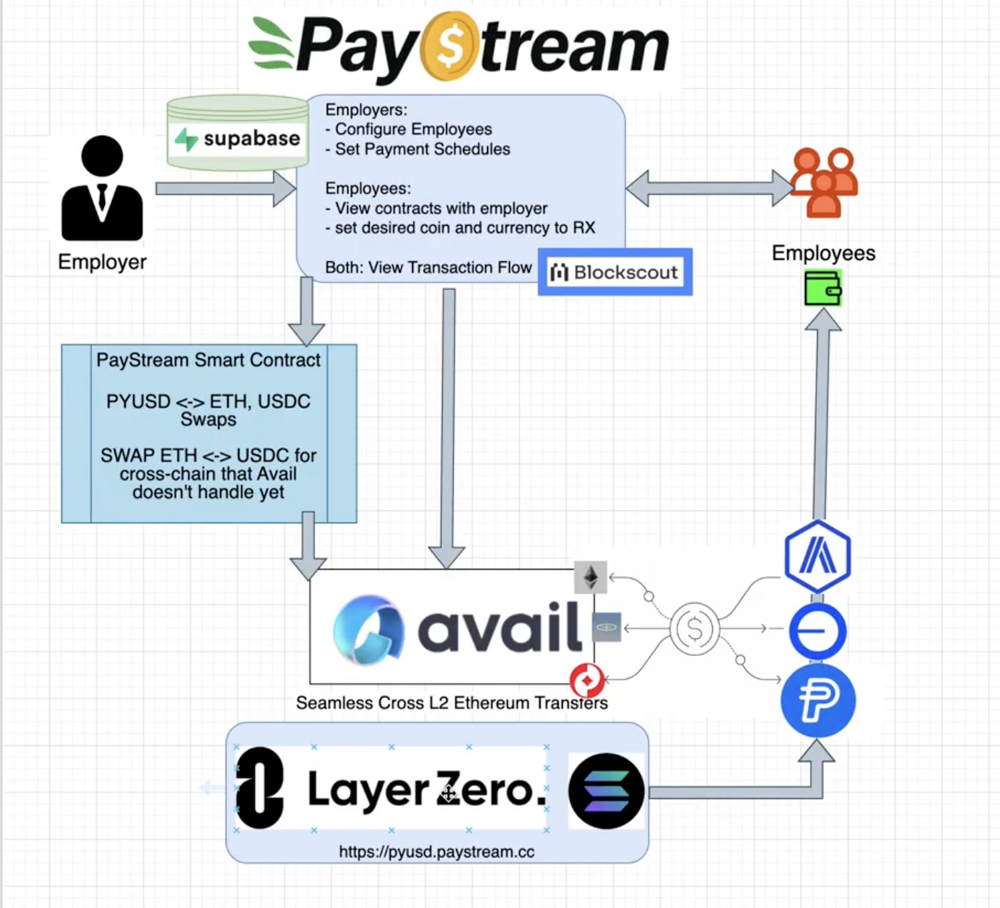

# PayStream - Decentralized Payroll Management System

A comprehensive Web3 payroll platform that revolutionizes how employers pay employees using cryptocurrency. PayStream enables cross-chain payments with intelligent routing, allowing employers to pay in any crypto while employees receive payments in their preferred token and blockchain of choice.

## 🌟 Key Features

### Multi-Chain Payment Flexibility with Intelligent Routing
- **Dual Preference System**: Employees set primary and secondary payment preferences for token type and blockchain network
- **Cross-Chain Cross-Token Transfers**: Since Avail's native transfer function doesn't support cross-chain cross-token transfers, we built custom smart contracts to enable ETH ↔ USDC swaps and facilitate multi-token swaps across different chains, expanding payment flexibility beyond Avail's native capabilities
- **Intelligent Fee Optimization**: Automatic comparison of transaction fees between preferences, routing through the most cost-effective option
- **Automatic Failsafe**: If primary preference fails, automatically retries on secondary preference
- **Smart Fee Comparison**: Evaluates total costs including gas prices, swap fees, and bridge costs


### PYUSD Integration & Fiat On/Off-Ramp
- **Accessible Onboarding**: Users without crypto can onramp directly using PayPal's PYUSD stablecoin
- **Cross-Chain Support**: PYUSD transfers between Ethereum and Solana via Layer Zero and Stargate Bridge
- **Complete Circular Flow**: Fiat → PYUSD → any crypto → PYUSD → fiat
- **One-Click Consolidation**: Gather balances from multiple chains and swap to PYUSD for easy off-ramping

### Advanced Transaction Tracking (Avail Intent Explorer)
- **Complete Payment Trail**: BlockScout integration showing full journey from employer to employee
- **Multi-Step Visibility**: Track deposits, conversions, and transfers with transaction hashes
- **Audit Compliance**: Full traceability for accounting and regulatory purposes

### One-Time Payment Links
- **QR Code & Link Generation**: Create shareable payment links for ad-hoc transactions
- **No Account Required**: Payers don't need employer accounts
- **Flexible Options**: Pay with any available crypto, recipient receives preferred currency


### Employee Management
- **Group-Based Organization**: Organize employees into payment groups for batch processing
- **Flexible Configuration**: Custom payment amounts and token preferences per employee
- **Complete Payment History**: Full audit trail of all transactions
- **Real-time Notifications**: Push-based updates for instant payment visibility

### Unified Balance & Gas Management
- **Multi-Chain Balance View**: See all holdings across supported chains in one dashboard
- **Gas Monitoring**: Automatic tracking of gas token balances across all active chains
- **Proactive Alerts**: Notifications when gas falls below operational thresholds
- **One-Click Refueling**: Simplified gas top-ups without manual bridge operations

## 🛠 Tech Stack

### Frontend & Backend
- **Frontend**: React 18, TypeScript, Vite
- **UI Framework**: shadcn/ui, Tailwind CSS
- **Web3 Integration**: Wagmi, MetaMask
- **Database**: Supabase (PostgreSQL with real-time subscriptions)
- **Architecture**: Serverless with Supabase Edge Functions

### Blockchain & Smart Contracts
- **Avail Nexus Framework**: Cross-chain transaction coordination and solver network
- **Custom Smart Contracts**: Solidity contracts for PYUSD conversions and unsupported token pairs
- **Supported Chains**: Ethereum Sepolia, Optimism Sepolia, Base, and more EVM-compatible chains
- **Cross-Chain**: Layer Zero Protocol and Stargate Bridge

### Payment Integration
- **PayPal PYUSD**: Stablecoin for on-ramp and off-ramp functionality
- **BlockScout API**: Transaction tracking, explorer links, and payment flow visualization

## 🚀 Getting Started

### Prerequisites
- Node.js 18+ and npm
- Supabase account and project
- Web3 wallet (MetaMask or compatible)
- BlockScout API key (optional)

### Installation
```bash
# Clone the repository
git clone <YOUR_GIT_URL>
cd paystream

# Install dependencies
npm install

# Set up environment variables
cp .env.example .env.local
```

### Environment Variables

Create a `.env.local` file with:
```env
VITE_SUPABASE_URL=your_supabase_url
VITE_SUPABASE_ANON_KEY=your_supabase_anon_key
VITE_BLOCKSCOUT_API_KEY=your_blockscout_api_key
```

### Development
```bash
# Start development server
npm run dev

# Build for production
npm run build

# Preview production build
npm run preview
```

## 📁 Project Structure
```
src/
├── components/          # Reusable UI components
├── pages/              # Page components
│   ├── admin/          # Admin dashboard pages
│   ├── employee/       # Employee portal pages
│   └── Landing.tsx     # Landing page
├── lib/                # Utility functions and services
│   ├── supabase.ts     # Supabase client and types
│   └── profileService.ts # Business logic services
└── providers/          # React context providers
```

## 🏗 Technical Architecture





### Payment Flow Pipeline

1. **Preference-Based Routing**: Employee preferences stored in Supabase with primary/secondary chain and token choices
2. **Fee Comparison Engine**: Queries gas prices and swap costs for both options, calculates total costs, selects optimal route
3. **Token Allowance Management**: Smart contract approvals set for solver interactions
4. **Avail Nexus Integration**: Deposit to solver → currency conversion → return transfer of converted funds
5. **Direct Transfer**: Final transfer to employee on chosen chain
6. **Failsafe Logic**: Automatic retry on secondary preference if primary fails
7. **Transaction Recording**: All steps logged to Supabase with BlockScout transaction hashes

### PYUSD Custom Implementation

Built custom smart contracts to bridge Avail Nexus limitations:
- **Swap Contracts**: Handle PYUSD → ETH and PYUSD → USDC conversions via DEX integrations
- **Multi-Step Flow**: PYUSD swapped to Avail-supported currency → Avail Nexus processes payment → Employee receives preferred token
- **Layer Zero Integration**: Enables PYUSD movement between Ethereum and Solana via Stargate
- **Consolidation Feature**: Gathers balances from multiple chains, swaps to PYUSD for PayPal off-ramp

### Real-Time Updates

Supabase real-time subscriptions provide instant payment notifications without polling, reducing server load and improving user experience.

## 🎯 Notable Technical Achievements

1. **Avail Nexus Workarounds**: Custom smart contracts handle edge cases for unsupported token pairs and chains, preprocessing payments before entering the Avail ecosystem

2. **BlockScout Integration**: Scraped transaction data to extract solver addresses and intermediate details, creating custom visualization of complete payment journeys

3. **Fee Optimization Algorithm**: Real-time comparison engine evaluates multiple routes considering gas prices, swap fees, and bridge costs

4. **PYUSD Testnet Support**: Deployed custom contracts and integrated Stargate Bridge to enable PYUSD functionality across target chains

5. **Unified Balance Aggregation**: Single dashboard view of employer funds across all supported networks

6. **Failsafe Architecture**: Automatic fallback logic handles transaction failures gracefully with cost optimization

## 🤝 Partner Technologies

- **Avail Nexus**: Cross-chain messaging and battle-tested solver network
- **BlockScout**: Transaction tracking without custom indexing infrastructure
- **Layer Zero/Stargate**: Ethereum-Solana PYUSD bridging with proven security
- **PayPal PYUSD**: Familiar fiat on/off-ramp for traditional users
- **Supabase**: Real-time database with built-in subscriptions

## 🔧 Challenges & Solutions

| Challenge | Solution |
|-----------|----------|
| Avail Nexus didn't support all token/chain combinations | Built preprocessing layer with custom swap contracts |
| Complex multi-step transactions difficult to track | Integrated BlockScout API and built custom visualization layer |
| Users needed gas on multiple chains | Implemented monitoring and one-click refueling system |
| Traditional users hesitant about crypto | PYUSD integration provides familiar PayPal-based on/off-ramp |

## 🚀 Deployment

Deploy to any static hosting service:

- **Vercel**: Connect your GitHub repository for automatic deployments
- **Netlify**: Deploy from Git or drag & drop build folder
- **Supabase**: Use Supabase hosting for full-stack deployment

## 🤝 Contributing

1. Fork the repository
2. Create a feature branch (`git checkout -b feature/amazing-feature`)
3. Commit your changes (`git commit -m 'Add amazing feature'`)
4. Push to the branch (`git push origin feature/amazing-feature`)
5. Open a Pull Request

## 📄 License

This project is licensed under the MIT License - see the LICENSE file for details.


## 📧 Contact

For questions or support, please open an issue or reach out to the team.

---

**Built for ETHGlobal 2025** - Revolutionizing payroll with Web3 technology
